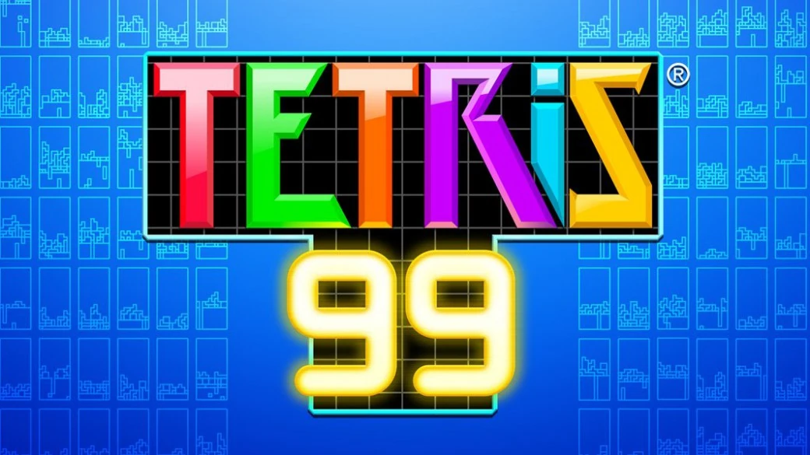
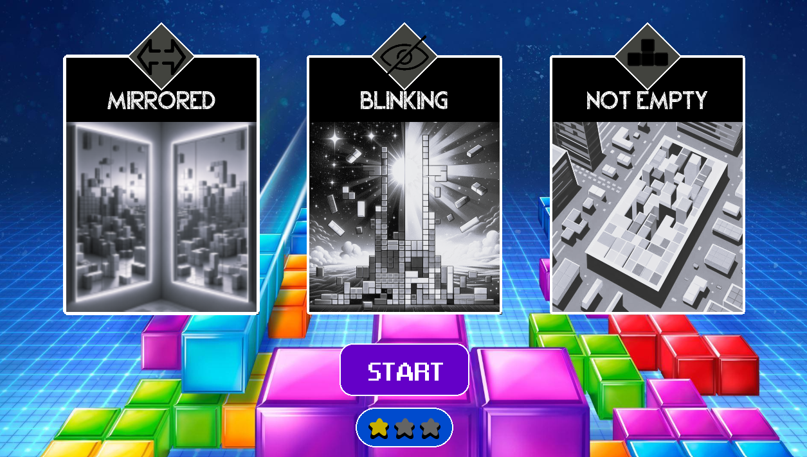
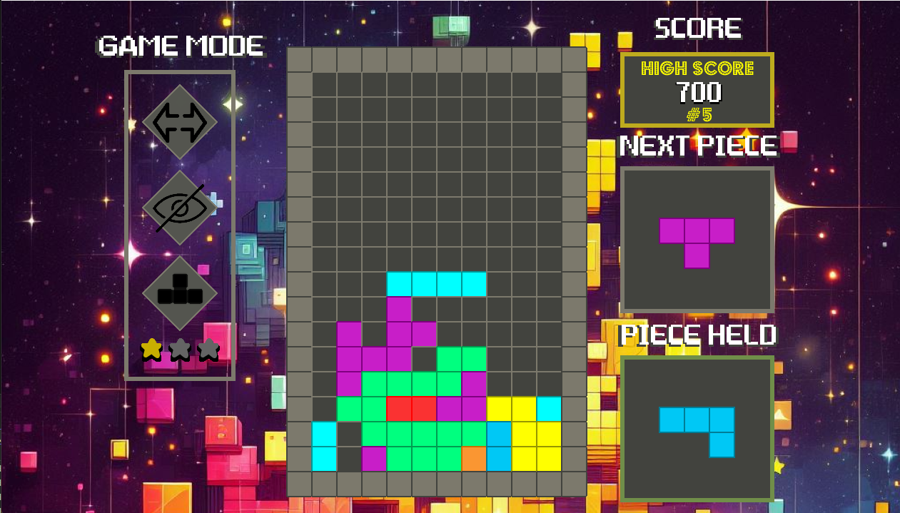

# TP FINAL POGRAMACION I | 2023 - 1C | TETRIS


## Descripción 

El presente proyecto corresponde al proyecto final de la materia Programación I en el Instituto Tecnologico de Buenos Aires, cuya consigna fue asignada durante el primer cuatrimestre de 2023.

Este consiste en programar el juego Tetris de manera tal que este corra en una PC (empleando la libreria Allegro5 para el aspecto gráfico) y en una Raspberry Pi que cuenta con los siguientes elementos:


## Instalación y ejecución

### Allegro 5
Este proyecto utiliza Allegro 5, una biblioteca para desarrollo de juegos y aplicaciones multimedia en C/C++. A continuación, se detallan los pasos para instalar Allegro 5 en tu sistema.

#### Paso 1: Instalar Allegro 5
Asegúrate de tener CMake y un compilador de C/C++ instalados en tu sistema.

En sistemas basados en Debian/Ubuntu, puedes usar el siguiente comando:

    $ sudo apt-get install liballegro5-dev

Para otras plataformas, sigue las instrucciones de instalación en la página oficial de Allegro.

#### Paso 2: Clonar este repositorio
    git clone https://github.com/Matias958/TetrisJuego.git
    cd TetrisJuego

#### Paso 3: Compilar y ejecutar
    make tetris_al
    ./tetris_al

## Generalidades

### Puntajes altos
Para almacenar los puntajes altos en el archivo _highscore.txt_ se usa un formato donde cada entrada comienza con tres caracteres que corresponden al nombre del autor de dicho puntaje seguido del puntaje hasta una coma. Por ejemplo:

```plaintext

RAM1000,MAT700,JUL300,FAC200,PAB100,

```

### Controles en PC

A continuación se detallan los controles para interactuar con este proyecto:

```plaintext

Teclas WASD o Flechas:

  - W o Flecha Arriba:     Rotar la Pieza.
  - A o Flecha Izquierda:  Mover hacia la izquierda.
  - S o Flecha Abajo:      Bajar la Pieza.
  - D o Flecha Derecha:    Mover hacia la derecha.

Tecla Espacio:        Bajar la pieza esta estacionarla.
Tecla Esc:            Entrar en el menu de pausa. 

```

### Controles en Raspberry Pi

## Aspectos gráficos en PC
A continuación se detallaran los distintos elementos gráficos que se pueden observar en las distintas ventanas del juego.

### Menu 
El menu cuenta con dos botones que permiten acceder a la ventana de selección del modo de juego o a la ventana de puntajes altos.


Estos botones son interactivos:


### Selección del modo de juego
En la ventana de selección de modo de juego se cuenta con tres modos disponibles:



Los cuadros de los modos de juego son interactivos, dando una breve descripción de la modificación que estos suponen dentro del juego al pararse sobre ellos y cambiando de color al seleccionarlos:


Para modificar el nivel de dificultad del juego, se ha de seleccionar el botón debajo de "START", modificando la cantidad de estrellas que indican los modos: EASY, MEDIUM y HARD; los cuales difieren en la velocidad de caida de las piezas.


### Juego 
Ya una vez dentro del juego, se mostrara un ventana con los modos de juego activos y la dificultad, el tablero de juego, el puntaje y la siguiente pieza.


Dentro del juego, cada vez que se realiza un tetris se muestra un animación sobre la fila completada, y en caso de que el puntaje obtenido entre dentro del TOP5 se le informa al jugador de esto.




Por otro lado, es posible pausar el juego con la tecla ESC, la cual abre un menu interactivo que permite terminar el jugo o reanudarlo (dentro de este menu se baja el volumen de la música):


#### Modos de juego
A continuación se hará una breve descripción de los posibles modos de juego, los cuales son acumulables:

##### Mirrored
Se invierten los controles izquierda y derecha.

##### Blinking
La piezas aparecen y desaparecen regularmente:


##### Not Empty
El tablero contiene piezas inicialmente:


### Ventana de Game Over 
Cuando se termine el juego se mostrara la ventana de Game Over, en la cual dejara elegir entre ir a la ventana de puntajes altos o volver a la selección del modo de juego.


En caso de alcanzar un puntaje dentro del top 5 historico se mostrará una ventana donde dejara elegir el nombre para identificar este puntaje, que debe estar compuesto por 3 caracteres entre letras y números.


### Ventana de puntajes altos
En la ventana de puntajes altos se muestran los 5 mejores puntajes historicos del juego.


## Creditos

Los creadores de este proyecto son:

- **Integrantes**
  - MATIAS ADRIAN MINNITI
  - RAMIRO NIETO ABASCAL
  - FACUNDO JULIÁN TORRES
  - JULIETA LIBERTAD RODRÍGUEZ

Para su confección se emplearon los siguientes recursos:

- **Recursos Externos:**
  - **Allegro 5**
    - [Enlace a la Página Oficial de Allegro 5](https://liballeg.org/)


